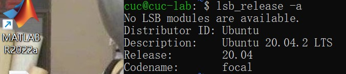
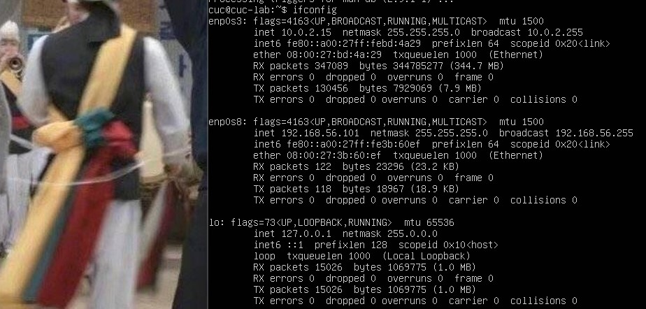
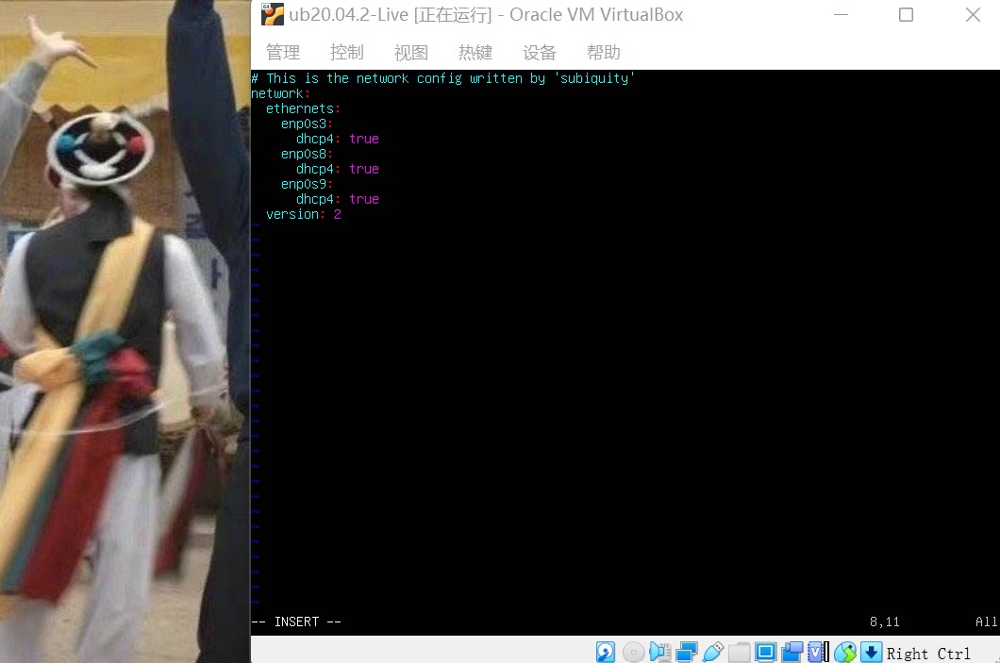
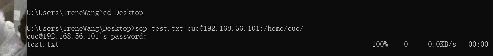
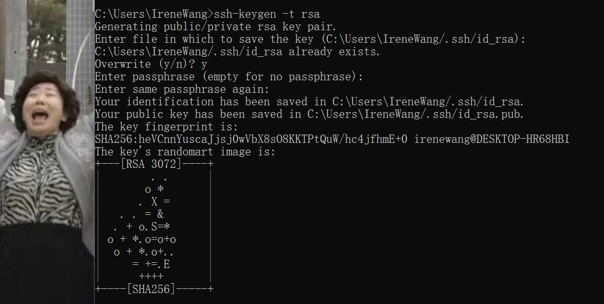

# Homework 1
# 一、调查并记录实验环境的如下信息
### 1. 当前 Linux 发行版基本信息:
### 使用命令`lsb_release -a`

### 2. 当前 Linux 内核版本信息:
### 使用命令`uname -a`

# 二、Virtualbox 安装完 Ubuntu 之后新添加的网卡如何实现系统开机自动启用和自动获取 IP？
### 1. 使用命令`ifconfig`查看现有网卡

### 2. 使用命令`cd /etc/netplan`、`ls`找到相应的yaml文件，使用命令`sudo vim /etc/netplan/00-installer-config.yaml`进入vim编辑器，手动添加：
```
enp0s8:
​   dhcp4: true
```

### 3. 退出vim编辑器：按Esc键，输入：进入命令行，输入命令`wq`保存并退出vim编辑器
### 4. 最后，执行命令`sudo netplan apply`

# 三、如何使用 scp 在「虚拟机和宿主机之间」、「本机和远程 Linux 系统之间」传输文件？
### 宿主机传输文件至虚拟机：
### 1. 在本机桌面新建test.txt文件
### 2. 使用命令`cd Desktop`切换至文件所在的桌面，使用命令`scp se.txt cuc@192.168.56.101:/home/cuc/`将本机桌面的test.txt传输至虚拟机

### 虚拟机传输文件至宿主机：
### 1. 使用`touch`命令在虚拟机中新建test.txt文件，并使用命令`pwd`查看它的路径

### 2. 使用命令`scp -r cuc@192.168.56.101:/home/cuc ./`将文件传输至本机桌面上


# 四、如何配置 SSH 免密登录？
### 使用命令`ssh-keygen -t rsa`生成公私钥对

### 使用命令`ssh-copy-id cuc@192.168.56.101`把主机上生成的公钥传到cuc@192.168.56.101中，配置完成

# 遇到的问题与解决方案
### 问题：不知道该怎么保存并退出vim编辑器
### 解答：https://blog.csdn.net/qq_43768851/article/details/121629428
### 问题：使用命令`ssh-copy-id cuc@192.168.56.101`时报错：command not found
### 解答：https://blog.csdn.net/qq_45754034/article/details/120623070